# Oficina Mecânica — Sistema de Ordens de Serviço

Aplicação web completa integrada a um SGBD relacional, desenvolvida para a
atividade NP1 da disciplina de **Banco de Dados**.

## Identificação

| | |
|---|---|
| **Instituição** | Universidade Paulista (UNIP) |
| **Curso** | Análise e Desenvolvimento de Sistemas |
| **Disciplina** | Banco de Dados |
| **Turma** | DS4P-17 |
| **Atividade** | Trabalho NP1 |

### Integrantes

| Nome completo | RA |
|---|---|
| Eduardo Matheus do Amaral Alves | H753BJ9 |
| Henrique Rodrigues Lindolfo | H6250F3 |
| Matheus Fernandes Pereira | H75IHD9 |
| Matheus Sousa Ribeiro | R850862 |
| Nicollas Abreu Svidevska de Camargo | R200965 |
| Vitor Roma Cunha Santos | R8504C4 |

---

## Guia rápido para o avaliador

Onde encontrar a evidência de cada um dos cinco critérios técnicos:

| # | Critério | Onde verificar |
|---|---|---|
| 1 | **Modelagem e Integridade** | [DER e dicionário de dados](#2-modelagem-de-dados) · DDL completo em [`sql/01_schema.sql`](sql/01_schema.sql) · normalização em [`docs/DER.md`](docs/DER.md) |
| 2 | **Manipulação de Dados (CRUD)** | [Escopo funcional](#escopo-funcional) · SQL em [`src/main/java/br/com/oficina/dao/`](src/main/java/br/com/oficina/dao/) · [transação explícita](#o-trecho-que-mais-importa-transação) |
| 3 | **Aderência às Restrições** | [Seção dedicada](#5-aderência-às-restrições-técnicas) — uma única dependência no [`pom.xml`](pom.xml) |
| 4 | **Funcionalidade e Usabilidade** | [Guia de execução](#3-guia-de-instalação-e-execução) · [validações em três camadas](#validações-e-tratamento-de-erros) |
| 5 | **Documentação e Reprodutibilidade** | Este arquivo · [evidências visuais](#4-evidências-visuais) · consultas de comprovação em [`docs/evidencias.sql`](docs/evidencias.sql) |

**Para rodar em 4 comandos**, veja o [guia de execução](#3-guia-de-instalação-e-execução).
Há dois caminhos: **com Docker** (mais rápido) e **com MySQL já instalado**.

---

## 1. Descrição do Projeto

### Tema

Sistema de gestão para uma **oficina mecânica de bairro**. O fluxo do negócio é
direto: o cliente traz o veículo e relata um problema; a oficina abre uma
**Ordem de Serviço (OS)**, lança nela os serviços executados e as peças
aplicadas, acompanha o status até a conclusão e fecha com o valor total.

O domínio foi escolhido porque produz naturalmente os relacionamentos que a
disciplina cobra: um **1:N** (cliente possui veículos), outro **1:N** (veículo é
atendido em ordens de serviço) e um **N:N** resolvido por entidade associativa
com atributos próprios (a OS lança vários serviços, cada um com quantidade e
preço praticado).

### Escopo funcional

| Módulo | Operações |
|---|---|
| **Clientes** | Criar, listar, buscar por nome/CPF, editar e excluir |
| **Veículos** | Criar, listar, buscar por placa/marca/modelo, editar, excluir e ver o histórico de atendimentos |
| **Serviços** | Catálogo de mão de obra e peças: criar, listar, buscar, editar, excluir e ativar/inativar |
| **Ordens de Serviço** | Abrir com itens, listar, filtrar por status, editar, excluir, acompanhar o status e imprimir a via em A4 |
| **Dashboard** | Indicadores da oficina, distribuição por situação, movimento dos últimos 6 meses e itens que mais faturam |
| **Usuários** | Login por e-mail e senha, perfis ADMIN e ATENDENTE, criar/editar/excluir contas e trocar senha |

As quatro operações CRUD estão implementadas em **todas** as entidades.

### Regras de negócio

Cada regra aponta onde ela é realmente garantida — quase sempre no banco.

| # | Regra | Onde é garantida |
|---|---|---|
| RN01 | O cliente é identificado pelo CPF, que não se repete | `UNIQUE (cpf)` + dígito verificador em `Validators.cpfValido` |
| RN02 | Um cliente pode ter vários veículos; todo veículo tem exatamente um dono | FK `veiculo.cliente_id` (1:N) |
| RN03 | Duas placas iguais não convivem no sistema | `UNIQUE (placa)` |
| RN04 | Cliente com veículo cadastrado não pode ser excluído | `ON DELETE RESTRICT` |
| RN05 | Toda OS é aberta para um veículo já cadastrado | FK `ordem_servico.veiculo_id` |
| RN06 | Veículo com OS registrada não pode ser excluído — o histórico é preservado | `ON DELETE RESTRICT` |
| RN07 | A OS percorre ABERTA → EM_ANDAMENTO → CONCLUIDA, podendo ser CANCELADA | `ENUM` em `ordem_servico.status` |
| RN08 | A conclusão nunca é anterior à abertura | `CHECK (data_conclusao >= data_abertura)` |
| RN09 | Ao concluir uma OS a data de conclusão é preenchida; ao reabrir, volta a nulo | `OrdemServicoDao.atualizar` |
| RN10 | Uma OS é composta por itens: serviços e/ou peças, cada um com quantidade | Associativa `item_os` (N:N) |
| RN11 | O mesmo serviço entra uma única vez por OS — repetir é aumentar a quantidade | `UNIQUE (ordem_servico_id, servico_id)` |
| RN12 | Quantidade sempre positiva e valor nunca negativo | `CHECK (quantidade > 0)`, `CHECK (valor_unitario >= 0)` |
| RN13 | O preço cobrado é congelado no lançamento: reajuste de tabela não altera OS antiga | `item_os.valor_unitario`, copiado de `servico.preco` |
| RN14 | O total da OS nunca é armazenado — é sempre calculado a partir dos itens | `SUM(quantidade * valor_unitario)` |
| RN15 | Excluir uma OS apaga seus itens, mas nunca o serviço do catálogo | `CASCADE` em `item_os`, `RESTRICT` em `servico` |
| RN16 | Serviço inativado some das OS novas, mas continua no histórico | `servico.ativo` + filtro `?ativos=true` |
| RN17 | A gravação de uma OS com seus itens é tudo ou nada | Transação explícita em `OrdemServicoDao.inserirComItens` |
| RN18 | Ninguém usa o sistema sem entrar com e-mail e senha | `FiltroAutenticacao` — sessão exigida na API e nas páginas |
| RN19 | A senha nunca é armazenada, só o hash PBKDF2 com sal | `Senhas.gerarHash` + `CHECK (senha_hash LIKE 'pbkdf2\_sha256$%')` |
| RN20 | O e-mail identifica a conta e não se repete | `UNIQUE (email)` em `usuario` |
| RN21 | Cinco senhas erradas bloqueiam a conta por 15 minutos | `usuario.tentativas_falhas` + `usuario.bloqueado_ate` |
| RN22 | Só o perfil ADMIN administra usuários, e o último ADMIN ativo não pode ser removido | `UsuarioHandler` + `UsuarioDao.contarAdminsAtivos` |

---

## 2. Modelagem de Dados

**SGBD:** MySQL 8.4 · **Engine:** InnoDB · **Charset:** utf8mb4

O schema tem **6 tabelas** e **24 restrições**: 6 chaves primárias, 4 chaves
estrangeiras, 5 restrições de unicidade e 9 restrições de verificação (`CHECK`).
Os números podem ser conferidos no próprio banco com a consulta 7b de
[`docs/evidencias.sql`](docs/evidencias.sql).

### Diagrama Entidade-Relacionamento

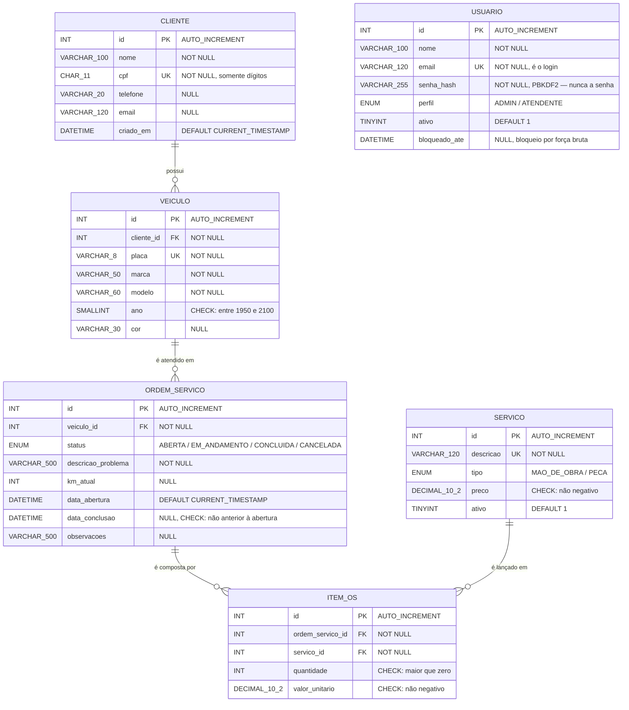

Em texto, para quem visualizar fora do GitHub:

    CLIENTE  1 ────< N  VEICULO  1 ────< N  ORDEM_SERVICO
                                                  │ 1
                                                  ∨ N
                                              ITEM_OS
                                                  ∧ N
                                                  │ 1
                                              SERVICO

`USUARIO` aparece isolada de propósito: ela é **controle de acesso**, não domínio
da oficina. Não há FK ligando usuário a ordem de serviço porque a OS é um fato do
negócio — ela continua válida mesmo que o funcionário que a digitou seja excluído
do sistema depois.

### Cardinalidades

| Relacionamento | Cardinalidade | Leitura |
|---|---|---|
| CLIENTE → VEICULO | 1 : N | Um cliente possui zero ou muitos veículos; todo veículo tem um dono |
| VEICULO → ORDEM_SERVICO | 1 : N | Um veículo é atendido em zero ou muitas OS; toda OS é de um veículo |
| ORDEM_SERVICO → ITEM_OS | 1 : N | Uma OS é composta por zero ou muitos itens |
| SERVICO → ITEM_OS | 1 : N | Um serviço do catálogo pode ser lançado em muitas OS |
| ORDEM_SERVICO ↔ SERVICO | N : N | Resolvido por `ITEM_OS`, que guarda quantidade e preço praticado |

### Integridade referencial

| FK | Referencia | ON DELETE | ON UPDATE | Por quê |
|---|---|---|---|---|
| `veiculo.cliente_id` | `cliente.id` | `RESTRICT` | `CASCADE` | Não se apaga um cliente que ainda tem veículo na oficina |
| `ordem_servico.veiculo_id` | `veiculo.id` | `RESTRICT` | `CASCADE` | O histórico de OS do veículo não pode ser perdido |
| `item_os.ordem_servico_id` | `ordem_servico.id` | `CASCADE` | `CASCADE` | Itens só existem dentro de uma OS |
| `item_os.servico_id` | `servico.id` | `RESTRICT` | `CASCADE` | Serviço já lançado em OS não some do catálogo |

### Normalização

O modelo está na **3ª Forma Normal**. Duas decisões merecem destaque:

**1. O total da OS não é armazenado.** Guardar `ordem_servico.valor_total` seria
dependência transitiva de dados que já estão em `item_os`, e qualquer alteração
de item deixaria o total defasado. O valor é sempre calculado:

```sql
SELECT SUM(quantidade * valor_unitario) FROM item_os WHERE ordem_servico_id = ?;
```

**2. `item_os.valor_unitario` não é redundância — é histórico.** À primeira vista
o preço já está em `servico.preco`. Mas `servico.preco` é o preço *de tabela
hoje*, e `item_os.valor_unitario` é o preço *cobrado naquela OS*. São fatos
diferentes: se a oficina reajustar a tabela, as OS já emitidas não podem mudar de
valor.

Dicionário de dados completo em [`docs/DER.md`](docs/DER.md).

### Script DDL

O DDL completo e comentado está em [`sql/01_schema.sql`](sql/01_schema.sql), e é
**idempotente** (`CREATE ... IF NOT EXISTS`) — pode rodar quantas vezes for
preciso. A carga de dados de exemplo está em [`sql/02_seed.sql`](sql/02_seed.sql).

Amostra, com os quatro tipos de restrição em uma tabela só:

```sql
CREATE TABLE IF NOT EXISTS item_os (
  id                INT UNSIGNED    NOT NULL AUTO_INCREMENT,
  ordem_servico_id  INT UNSIGNED    NOT NULL,
  servico_id        INT UNSIGNED    NOT NULL,
  quantidade        INT UNSIGNED    NOT NULL DEFAULT 1,
  valor_unitario    DECIMAL(10,2)   NOT NULL,
  CONSTRAINT pk_item_os          PRIMARY KEY (id),
  CONSTRAINT uq_item_os          UNIQUE (ordem_servico_id, servico_id),
  CONSTRAINT ck_item_os_qtd      CHECK (quantidade > 0),
  CONSTRAINT ck_item_os_valor    CHECK (valor_unitario >= 0),
  CONSTRAINT fk_item_os_os       FOREIGN KEY (ordem_servico_id) REFERENCES ordem_servico (id)
    ON DELETE CASCADE ON UPDATE CASCADE,
  CONSTRAINT fk_item_os_servico  FOREIGN KEY (servico_id) REFERENCES servico (id)
    ON DELETE RESTRICT ON UPDATE CASCADE
) ENGINE=InnoDB;
```

---

## 3. Guia de Instalação e Execução

Instruções a partir do **repositório limpo**, em Windows, Linux ou macOS.

### Pré-requisitos

| Programa | Versão | Para quê |
|---|---|---|
| **JDK** | 21 ou mais novo | Compilar e rodar a aplicação |
| **Git** | qualquer | Clonar o repositório |
| **MySQL** | 8.x | O banco — via Docker (caminho A) ou instalado (caminho B) |

**Não é preciso instalar o Maven:** o repositório traz o Maven Wrapper (`mvnw` e
`mvnw.cmd`), que baixa a versão certa sozinho na primeira execução.

Confira no terminal:

    java -version            # precisa mostrar 21 ou mais

### Passo 1 — Clonar

    git clone https://github.com/Lindolfoo/OficinaMecanica.git
    cd OficinaMecanica

### Passo 2 — Subir o banco

Escolha **um** dos dois caminhos.

#### Caminho A — com Docker (recomendado)

Não exige MySQL instalado. Com o Docker aberto:

    docker compose up -d

Na primeira vez o container cria o schema e carrega os dados de exemplo
automaticamente; aguarde uns 20 segundos. Pronto, pule para o passo 3.

#### Caminho B — com MySQL já instalado

Se você já tem MySQL na máquina e prefere não usar Docker, rode os dois scripts
com um usuário que possa criar schema:

    mysql -u root -p < sql/01_schema.sql
    mysql -u root -p < sql/02_seed.sql

No Windows, se o `mysql` não estiver no PATH, use o caminho completo (por
exemplo `"C:\Program Files\MySQL\MySQL Server 8.0\bin\mysql.exe"`) ou abra os
dois arquivos no MySQL Workbench e execute cada um.

Se o seu usuário/senha **não** forem `root`/`root`, informe os seus no passo 4
(veja *Configuração*).

### Passo 3 — Gerar o executável

    ./mvnw package          # Linux e macOS
    mvnw.cmd package        # Windows

Gera `target/oficina.jar`, com o driver do MySQL já embutido.

### Passo 4 — Rodar

    java -jar target/oficina.jar

Se o seu MySQL usa outro usuário ou senha:

    # Linux e macOS
    DB_USER=seu_usuario DB_PASSWORD=sua_senha java -jar target/oficina.jar

    # Windows (PowerShell)
    $env:DB_USER="seu_usuario"; $env:DB_PASSWORD="sua_senha"
    java -jar target/oficina.jar

Quando aparecer `Servidor no ar: http://localhost:8080`, abra
<http://localhost:8080>. Para encerrar, **Ctrl+C**.

### Passo 5 — Primeiro acesso

A tabela `usuario` nasce vazia, então a aplicação cria sozinha um administrador e
mostra os dados no console:

    e-mail: admin@oficina.local
    senha:  oficina2026

Entre com eles. Depois é possível trocar a senha em **menu do usuário › Trocar
minha senha** e cadastrar outras contas em **Administração › Usuários**.

> Nas próximas vezes bastam os passos 2 e 4.

### Configuração

Os padrões estão em [`src/main/resources/config.properties`](src/main/resources/config.properties).
Qualquer chave pode ser sobrescrita por variável de ambiente:

| Chave | Variável | Padrão | Para quê |
|---|---|---|---|
| `server.host` | `HOST` | `127.0.0.1` | `0.0.0.0` libera o acesso pela rede |
| `server.port` | `PORT` | `8080` | Porta da aplicação |
| `db.url` | `DB_URL` | `jdbc:mysql://localhost:3306/oficina...` | Endereço do banco |
| `db.user` / `db.password` | `DB_USER` / `DB_PASSWORD` | `root` / `root` | Credenciais do MySQL |
| `db.autoSchema` | `DB_AUTO_SCHEMA` | `true` | Aplica o DDL na subida |
| `auth.sessaoMinutos` | `SESSAO_MINUTOS` | `30` | Inatividade até a sessão cair |
| `auth.adminEmail` / `auth.adminSenha` | `ADMIN_EMAIL` / `ADMIN_SENHA` | `admin@oficina.local` / `oficina2026` | Administrador da primeira execução |

Exemplo com a aplicação na porta 8090 e o MySQL na 3307:

    PORT=8090 DB_URL="jdbc:mysql://localhost:3307/oficina?allowPublicKeyRetrieval=true" java -jar target/oficina.jar

### Problemas comuns

| Sintoma | Causa provável | Solução |
|---|---|---|
| `ERRO: não foi possível conectar ao MySQL` | Banco fora do ar ou credenciais diferentes | Confira se o MySQL subiu; informe `DB_USER`/`DB_PASSWORD` |
| `port is already allocated` no Docker | Já existe um MySQL na porta 3306 | Pare o outro MySQL, ou troque para `"127.0.0.1:3307:3306"` no `docker-compose.yml` e informe `DB_URL` |
| `release version 21 not supported` | JDK anterior ao 21 | Instale o JDK 21+ (Temurin, em adoptium.net) |
| `./mvnw: Permission denied` | Script sem permissão | `chmod +x mvnw` |
| Porta 8080 ocupada | Outro programa usando a porta | Rode com `PORT=8090` |
| Acentos errados no terminal | Charset do cliente | Use `--default-character-set=utf8mb4` |

### Recomeçar o banco do zero

    docker compose down -v
    docker compose up -d

### Acessar o banco pelo MySQL Workbench

Host `127.0.0.1`, porta `3306`, usuário `root`, senha `root`, schema `oficina`.

---

## 4. Evidências Visuais

### Interface

| | |
|---|---|
|  | 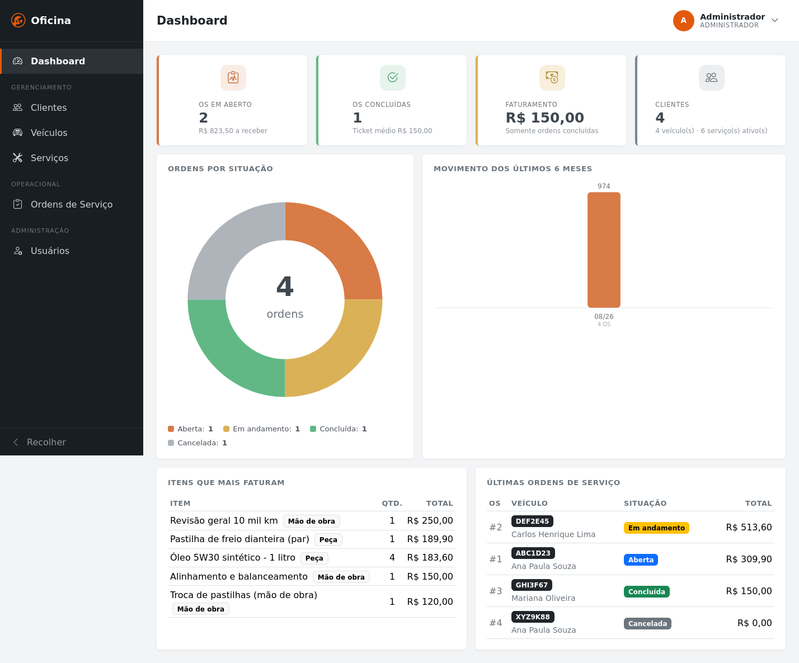 |
| Tela de login — acesso por e-mail e senha | Dashboard com indicadores e gráficos |
|  |  |
| Lista de clientes com busca | Ordens de serviço com status e total |

### CRUD em funcionamento

| | |
|---|---|
|  | 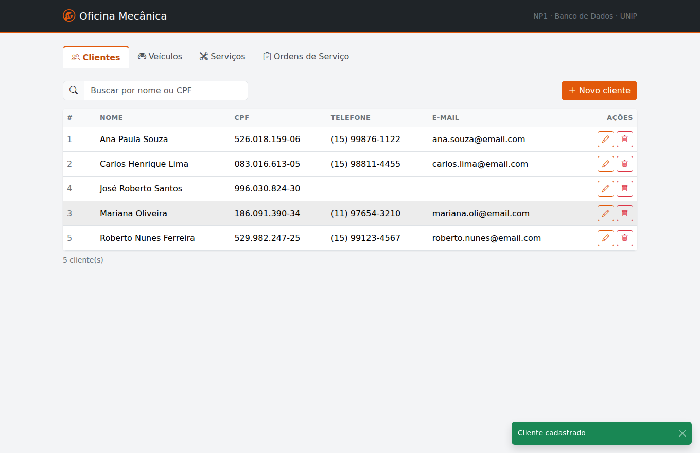 |
| **CREATE** — formulário de cadastro | O registro aparece na lista |
|  | 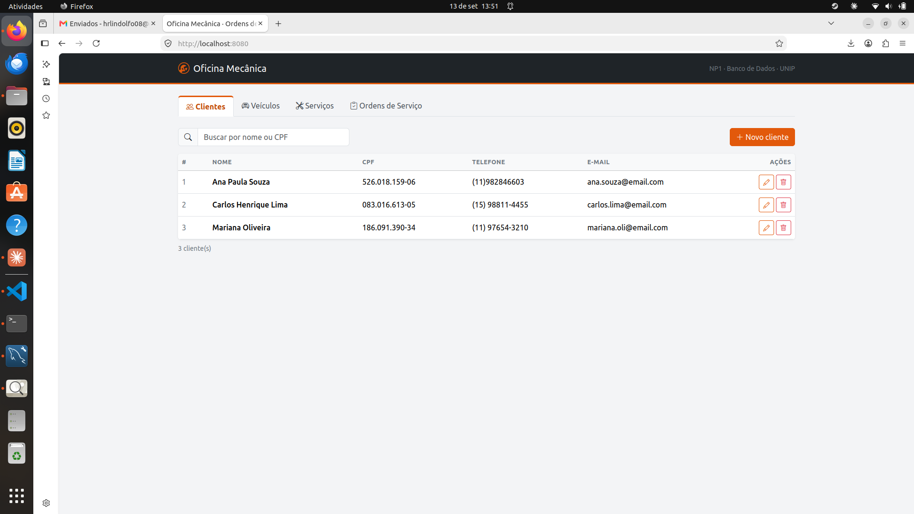 |
| **UPDATE** — alterando o telefone | A lista já com o dado alterado |
| 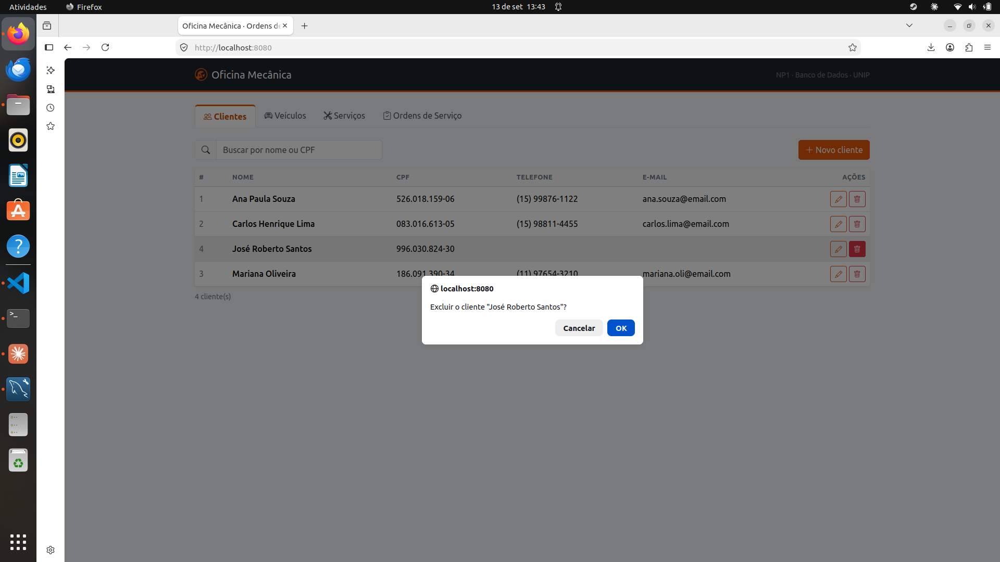 |  |
| **DELETE** — confirmação antes de excluir | **READ/validação** — CPF rejeitado pelo dígito verificador |
|  |  |
| OS com itens e total calculado | Filtro por status |

### Persistência no banco

Evidências colhidas no MySQL, com as consultas de
[`docs/evidencias.sql`](docs/evidencias.sql):

| | |
|---|---|
| 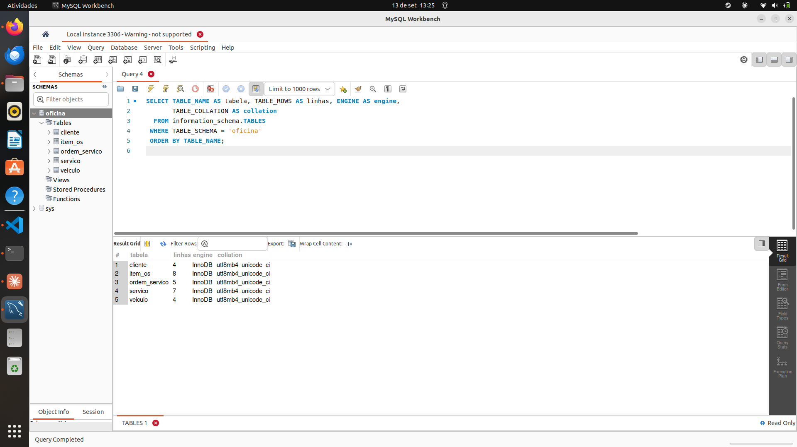 | 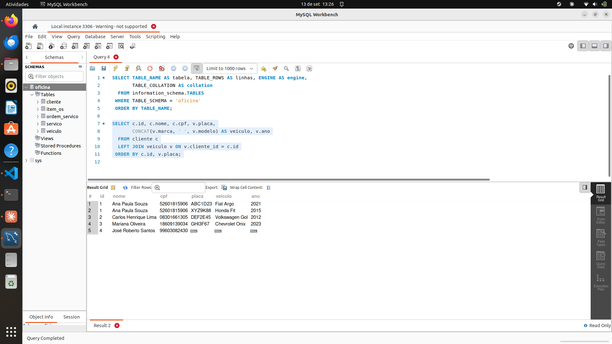 |
| As tabelas do schema `oficina` | O 1:N entre cliente e veículo |
| 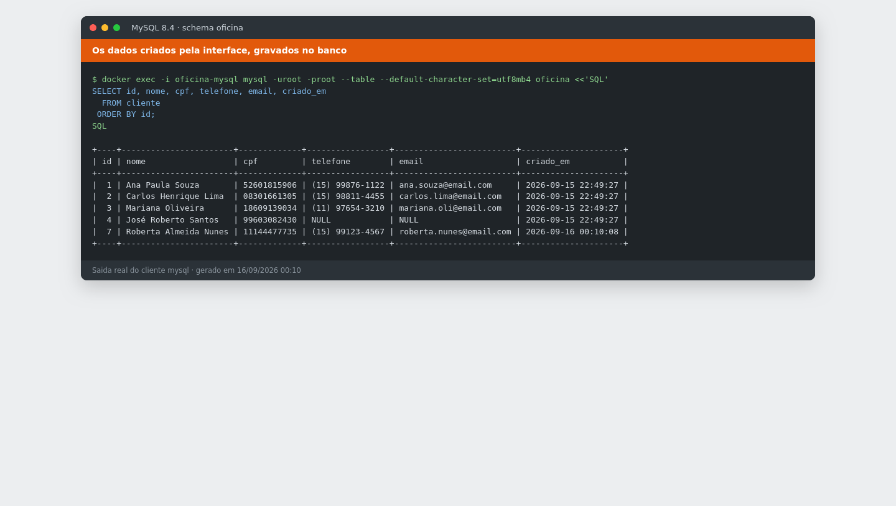 | 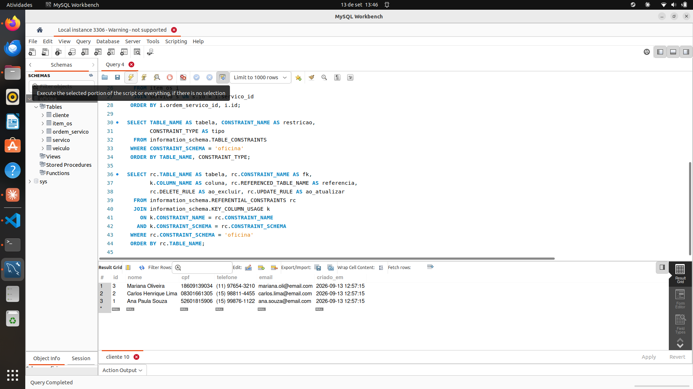 |
| Os dados criados pela tela, persistidos | Depois do DELETE, o registro some do banco |
| 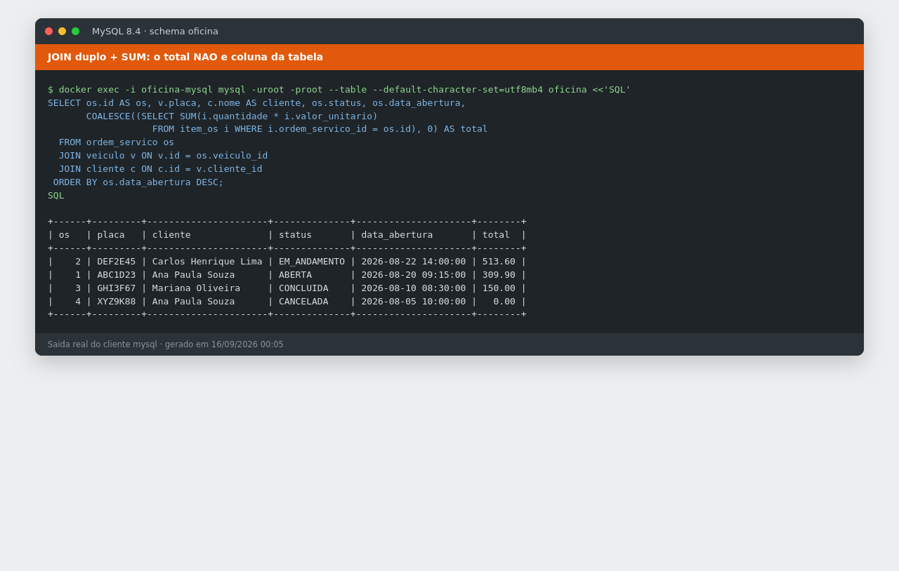 | 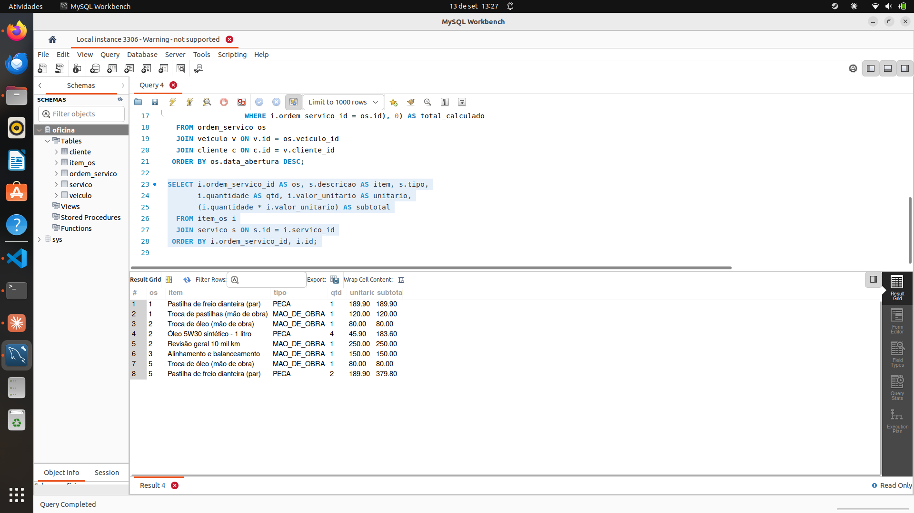 |
| JOIN duplo e total por `SUM` — não há coluna de total | Os itens gravados pela transação |
| 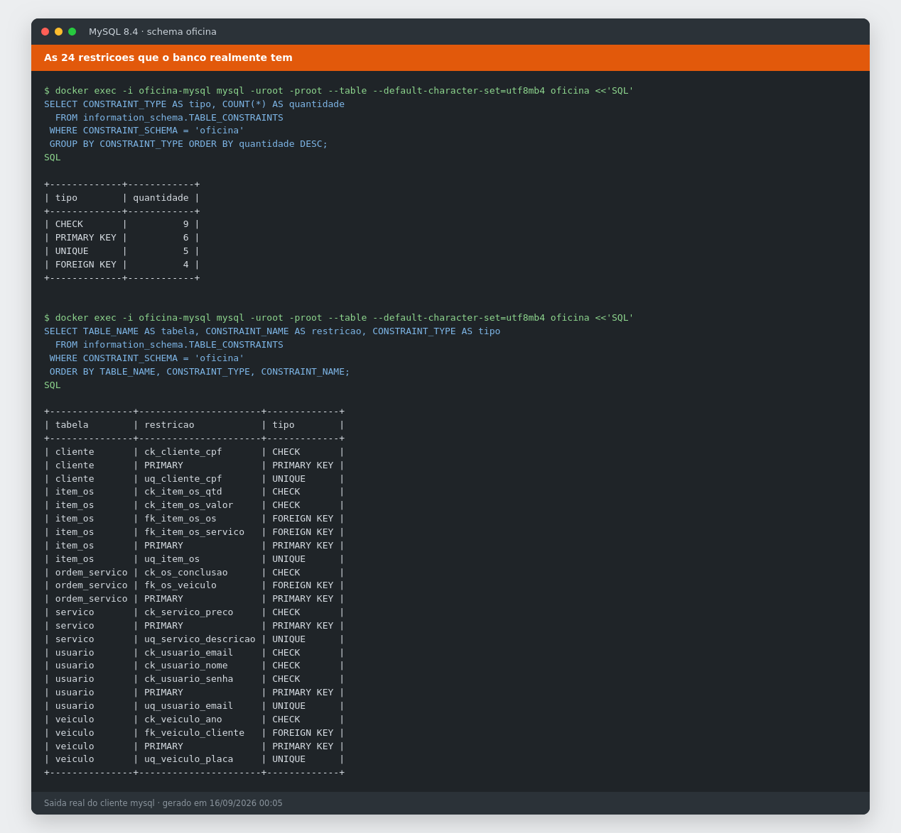 | 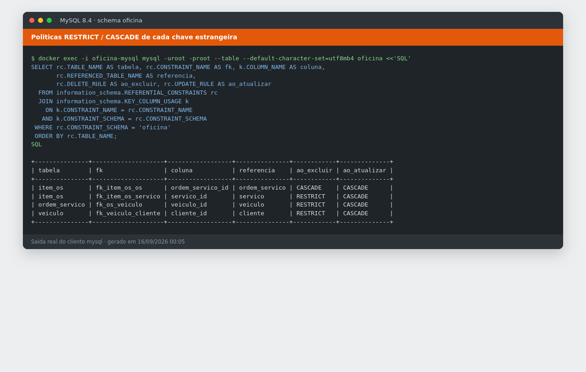 |
| As restrições que o banco tem | `RESTRICT`/`CASCADE` de cada FK |
| 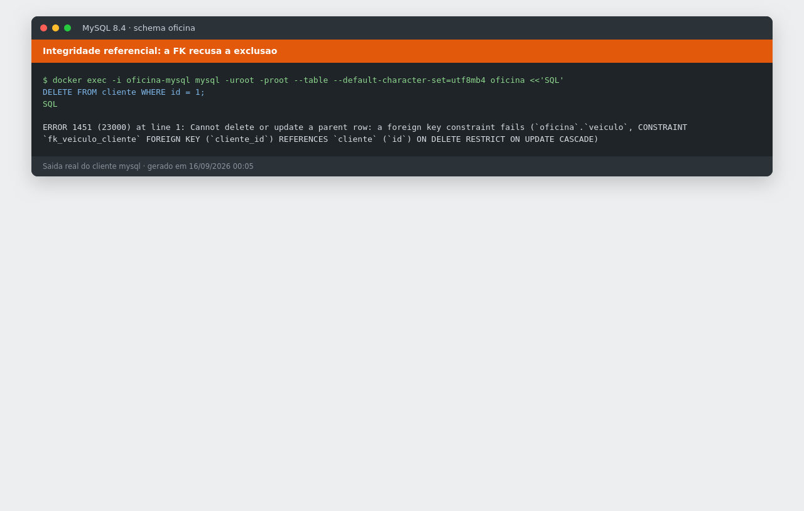 | |
| `ERROR 1451` — a FK recusa a exclusão | |

Todos os prints estão em [`docs/prints/`](docs/prints/).

### Como reproduzir as evidências

    docker exec -i oficina-mysql mysql -uroot -proot \
      --table --default-character-set=utf8mb4 < docs/evidencias.sql

O arquivo traz ainda três comandos que **falham de propósito** — o erro é
justamente a prova de que a integridade está ativa (FK bloqueando exclusão,
`CHECK` recusando senha em texto puro e `CHECK` recusando CPF inválido).

---

## 5. Aderência às Restrições Técnicas

| Restrição da atividade | Como o projeto cumpre | Onde verificar |
|---|---|---|
| SGBD: SQL Server, MySQL ou SQLite | **MySQL 8.4** | [`docker-compose.yml`](docker-compose.yml) |
| Linguagem: C#, Python, TypeScript, PHP ou Java | **Java 21** | [`pom.xml`](pom.xml) |
| **Proibido framework no back-end** | Nenhum. Servidor HTTP é o `com.sun.net.httpserver`, que já vem no JDK | [`App.java`](src/main/java/br/com/oficina/App.java) |
| **Proibido ORM** | Nenhum. Todo mapeamento é escrito à mão nos DAOs | [`dao/`](src/main/java/br/com/oficina/dao/) |
| SQL direto via driver nativo | JDBC puro (`java.sql`) com `PreparedStatement` em todas as consultas | [`ClienteDao.java`](src/main/java/br/com/oficina/dao/ClienteDao.java) |
| Front-end: HTML5, CSS3, JS puro, jQuery, Bootstrap | Exatamente isso — jQuery 3 e Bootstrap 5 (com Bootstrap Icons), servidos localmente | [`static/vendor/`](src/main/resources/static/vendor/) |
| **Proibido SPA** (React, Angular, Vue) | Nenhum. A navegação é jQuery puro | [`app.js`](src/main/resources/static/js/app.js) |

**O `pom.xml` tem uma única dependência: o driver JDBC do MySQL (Connector/J)** —
exatamente o "driver nativo de conexão da linguagem" que a atividade pede. Nem
para criptografia há biblioteca externa: o PBKDF2 vem do `javax.crypto`, do
próprio JDK. Os gráficos do dashboard são SVG escrito à mão, sem biblioteca de
gráficos.

Sobre `Statement` × `PreparedStatement`: o projeto tem **38 usos de
`PreparedStatement` e um único `createStatement`**, em
[`Database.java`](src/main/java/br/com/oficina/db/Database.java#L47), usado
apenas para executar o script DDL na subida — onde não há entrada de usuário.
Toda consulta que recebe dado de fora é parametrizada.

---

## Arquitetura do código

    sql/                      DDL e carga inicial
    src/main/java/br/com/oficina/
      App.java                sobe o servidor, registra rotas e filtros
      config/                 leitura de config.properties e variáveis de ambiente
      db/Database.java        conexões JDBC e aplicação do schema
      http/                   Json, HttpUtil, BaseHandler, StaticHandler
      security/               Senhas (PBKDF2), Sessoes e os filtros de acesso
      model/                  records espelhando as tabelas
      dao/                    o SQL de cada tabela
      api/                    validação de entrada e tradução HTTP
      util/Validators.java    CPF (módulo 11), e-mail e força da senha
    src/main/resources/static/
      login.html, js/login.js   tela de entrada
      index.html, js/app.js     menu lateral, dashboard e os módulos
      css/style.css             identidade visual
      vendor/                   jQuery e Bootstrap locais — roda sem internet
    docs/                     DER, arquitetura, evidências e prints

Cada módulo tem sempre as mesmas três camadas:

    model/X.java      -> espelho da tabela (record)
    dao/XDao.java     -> o SQL: listar, buscarPorId, inserir, atualizar, excluir
    api/XHandler.java -> validação de entrada + tradução HTTP

Fluxo de uma requisição:

    navegador (jQuery $.ajax)
        -> FiltroSeguranca      (cabeçalhos de segurança)
        -> FiltroAutenticacao   (exige sessão; confere o token CSRF)
        -> App.java (rota)
        -> XHandler (valida a entrada)
        -> XDao (PreparedStatement)
        -> MySQL
        -> volta como JSON

[`docs/ARQUITETURA.md`](docs/ARQUITETURA.md) sugere a ordem de leitura do código.

### O trecho que mais importa: transação

[`OrdemServicoDao.inserirComItens`](src/main/java/br/com/oficina/dao/OrdemServicoDao.java)
é o único ponto com transação explícita — a gravação de uma OS com seus itens é
tudo ou nada:

```java
c.setAutoCommit(false);   // abre a transação
// ... grava o cabeçalho e depois cada item ...
c.commit();               // confirma tudo
// no catch: c.rollback() -> desfaz tudo
```

Sem isso, uma falha ao gravar o terceiro item deixaria no banco uma OS pela metade.

### Validações e tratamento de erros

São **três camadas**, de propósito:

1. **HTML** (`required`, `pattern`) — conveniência; o usuário vê na hora.
2. **Handler** (Java) — a regra real; o HTML pode ser burlado pelo DevTools.
3. **Banco** (`CHECK`/`UNIQUE`/`FK`) — a última linha de defesa, vale até para
   quem acessar o banco por fora da aplicação.

Os erros do banco são traduzidos para mensagens em português e para o status HTTP
certo em [`BaseHandler`](src/main/java/br/com/oficina/http/BaseHandler.java):

| Status | Quando |
|---|---|
| `400` | Entrada inválida (CPF, placa, campo obrigatório) ou `CHECK` do banco |
| `401` | Sem sessão, ou e-mail/senha inválidos |
| `403` | Sem permissão (ATENDENTE em rota de ADMIN) ou sem token CSRF |
| `404` | Registro não encontrado |
| `409` | `UNIQUE` ou `FOREIGN KEY` — CPF repetido, ou exclusão com dependentes |
| `429` | Conta bloqueada por senhas erradas, ou tentativas demais do mesmo endereço |

### API

Respostas em JSON; entrada como formulário (`application/x-www-form-urlencoded`).

| Método | Rota | Descrição |
|---|---|---|
| `GET` | `/api/clientes` | lista — `?busca=texto` |
| `POST` | `/api/clientes` | cria — `nome, cpf, telefone, email` |
| `PUT` | `/api/clientes/{id}` | altera |
| `DELETE` | `/api/clientes/{id}` | exclui |
| `GET` | `/api/veiculos` | lista — `?busca=`, `?clienteId=` |
| `GET` | `/api/servicos` | lista — `?busca=`, `?ativos=true` |
| `GET` | `/api/ordens` | lista — `?status=`, `?busca=`, `?veiculoId=` |
| `GET` | `/api/ordens/resumo` | quantidade e total por status (`GROUP BY`) |
| `GET` | `/api/ordens/{id}` | uma OS com seus itens |
| `POST` | `/api/ordens` | cria a OS e os itens **em uma transação** |
| `POST` | `/api/ordens/{id}/itens` | adiciona um item |
| `DELETE` | `/api/ordens/{id}/itens/{itemId}` | remove um item |
| `GET` | `/api/dashboard` | indicadores, gráficos e últimas OS |
| `POST` | `/api/auth/login` · `/logout` · `/senha` | entrar, sair e trocar a senha |
| `GET` | `/api/usuarios` | lista contas — **só ADMIN** |

Veículos e serviços seguem o mesmo padrão CRUD dos clientes. Toda rota que altera
dados exige o cabeçalho `X-CSRF-Token`.

---

## Segurança

Não era exigência da atividade, mas o sistema tem login e vale registrar o que
foi feito:

| Ataque | Defesa |
|---|---|
| Vazamento do banco expondo senhas | Senha nunca é gravada: só o **PBKDF2-SHA256**, 210 mil iterações, com sal por usuário |
| Gravar senha em texto direto no banco | `CHECK (senha_hash LIKE 'pbkdf2\_sha256$%')` — o MySQL recusa |
| Força bruta | 5 erros bloqueiam a conta por 15 min; no máximo 10 tentativas/min por endereço |
| Enumeração de usuários | Mensagem sempre igual e tempo de resposta constante |
| Editar o cookie para virar ADMIN | O cookie só tem um token aleatório de 256 bits |
| Roubo de cookie por script injetado | Cookie `HttpOnly` + CSP travando `script-src` em `'self'` |
| CSRF | Token obrigatório em `POST`/`PUT`/`DELETE` + `SameSite=Strict` |

O que **não** está resolvido, e é honesto dizer: o tráfego é HTTP puro. Em
produção isso pediria um proxy com HTTPS e `auth.cookieSeguro=true`. As sessões
vivem em memória — reiniciar a aplicação desloga todo mundo.

---

## Licença

MIT — veja [LICENSE](LICENSE).
