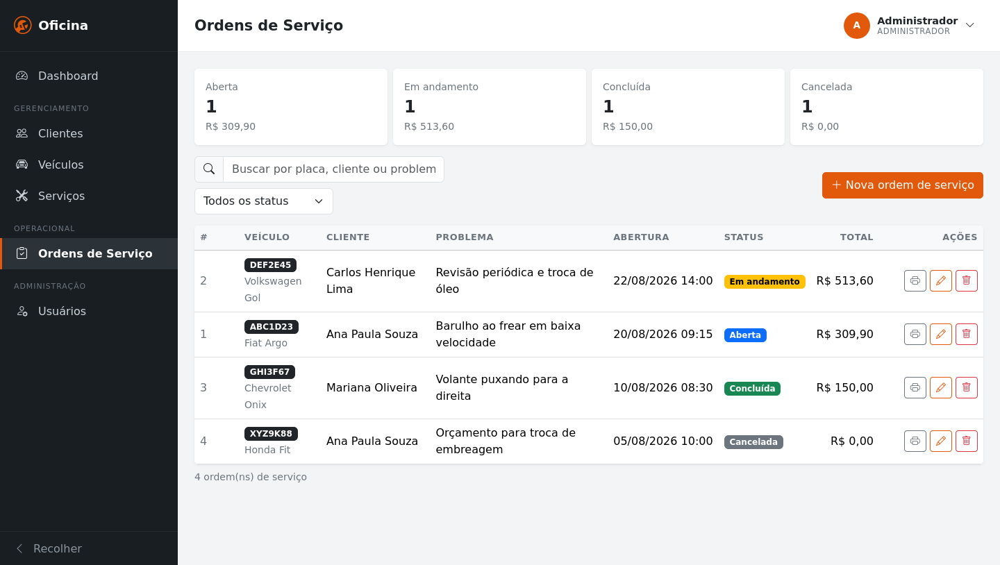
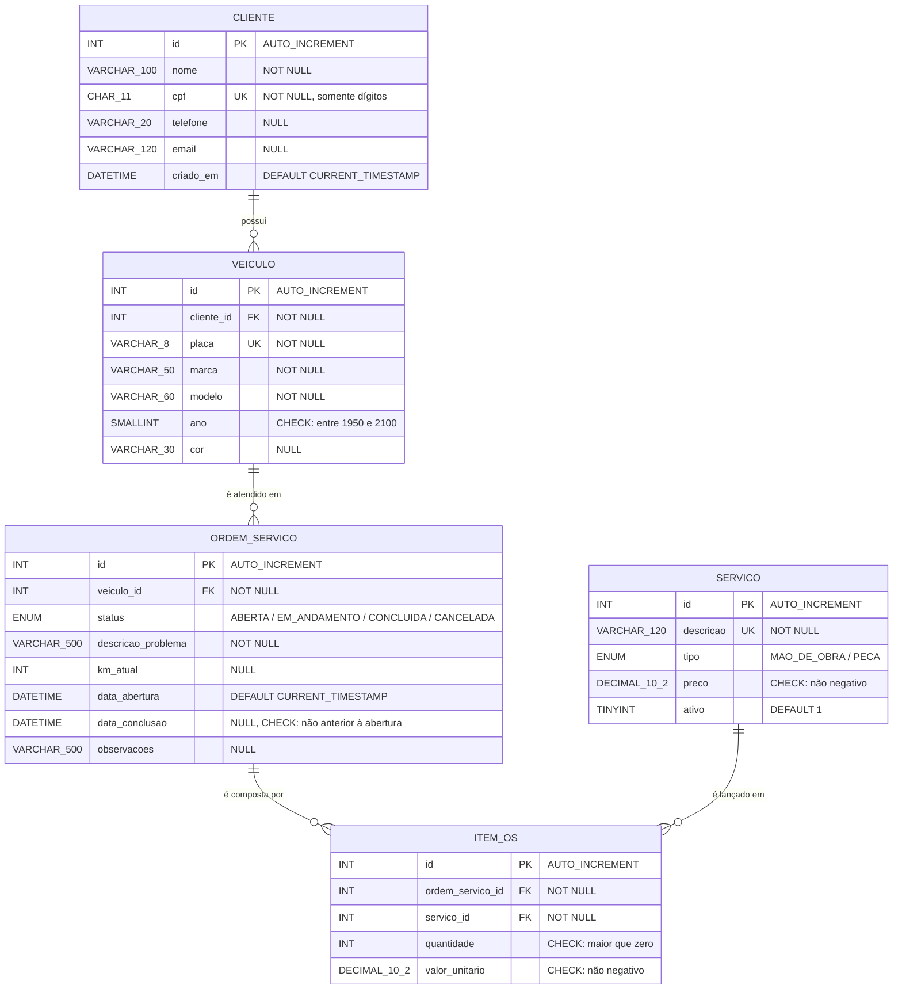
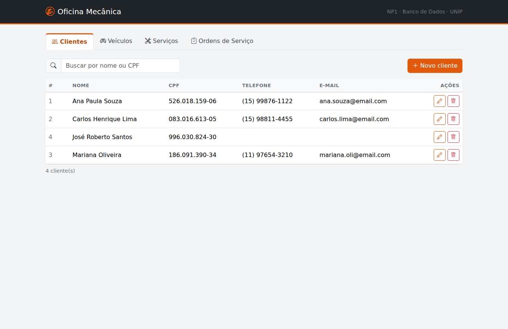
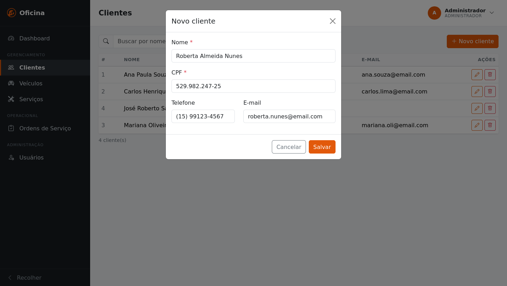
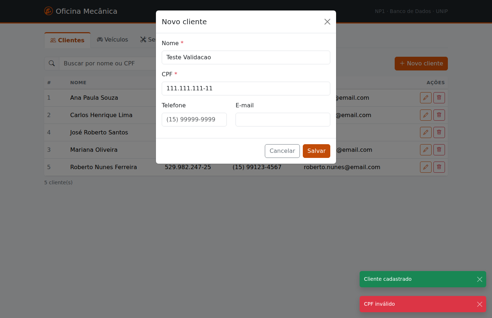
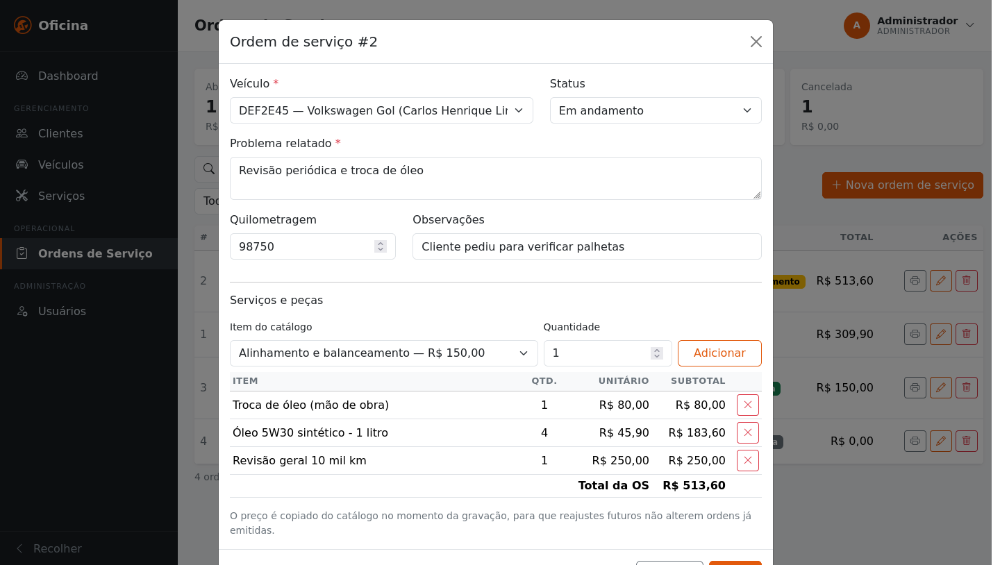
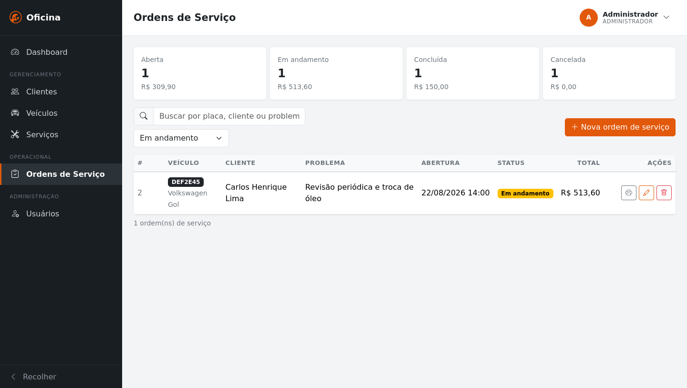
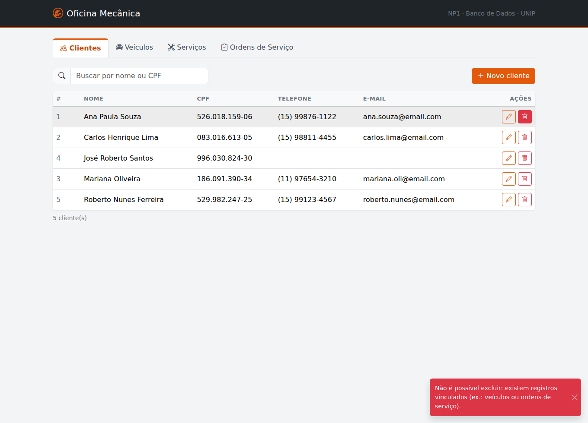

# Oficina Mecânica — Sistema de Ordens de Serviço

**Universidade Paulista (UNIP)** — Trabalho NP1 da disciplina de **Banco de Dados**

| | |
|---|---|
| **Curso** | Análise e Desenvolvimento de Sistemas |
| **Turma** | DS4P-17 |

### Integrantes

| Nome completo | RA |
|---|---|
| Eduardo Matheus do Amaral Alves | H753BJ9 |
| Henrique Rodrigues Lindolfo | H6250F3 |
| Matheus Fernandes Pereira | H75IHD9 |
| Matheus Sousa Ribeiro | R850862 |
| Nicollas Abreu Svidevska de Camargo | R200965 |
| Vitor Roma Cunha Santos | R8504C4 |

---

Sistema web de gestão para uma oficina mecânica: cadastro de clientes e veículos,
catálogo de serviços, e abertura de ordens de serviço com itens e total calculado.



## O domínio e as regras de negócio

O sistema atende o fluxo de uma oficina mecânica de bairro: o cliente traz o
veículo e relata um problema; a oficina abre uma **Ordem de Serviço (OS)**, lança
nela os serviços executados e as peças aplicadas, acompanha o status até a
conclusão e fecha com o valor total.

### Escopo funcional

| Módulo | O que faz |
|---|---|
| **Clientes** | Cadastro, edição, exclusão e busca por nome ou CPF |
| **Veículos** | Cadastro vinculado ao proprietário; busca por placa, marca ou modelo; histórico de atendimentos |
| **Serviços** | Catálogo de mão de obra e peças, com preço de tabela e ativação/inativação |
| **Ordens de Serviço** | Abertura com itens, mudança de status, filtro por status, resumo de faturamento e impressão da via em A4 |

### Regras

| # | Regra | Onde é garantida |
|---|---|---|
| RN01 | O cliente é identificado pelo CPF, que não se repete | `UNIQUE (cpf)` + dígito verificador em `Validators.cpfValido` |
| RN02 | Um cliente pode ter vários veículos; todo veículo tem exatamente um dono | FK `veiculo.cliente_id` (1:N) |
| RN03 | Duas placas iguais não convivem no sistema | `UNIQUE (placa)` |
| RN04 | Cliente com veículo cadastrado não pode ser excluído | `ON DELETE RESTRICT` |
| RN05 | Toda OS é aberta para um veículo já cadastrado | FK `ordem_servico.veiculo_id` |
| RN06 | Veículo com OS registrada não pode ser excluído — o histórico é preservado | `ON DELETE RESTRICT` |
| RN07 | A OS percorre ABERTA → EM_ANDAMENTO → CONCLUIDA, podendo ser CANCELADA | `ENUM` em `ordem_servico.status` |
| RN08 | A conclusão nunca é anterior à abertura | `CHECK (data_conclusao >= data_abertura)` |
| RN09 | Ao concluir uma OS a data de conclusão é preenchida; ao reabrir, volta a nulo | `OrdemServicoDao.atualizar` |
| RN10 | Uma OS é composta por itens: serviços e/ou peças, cada um com quantidade | Associativa `item_os` (N:N) |
| RN11 | O mesmo serviço entra uma única vez por OS — repetir é aumentar a quantidade | `UNIQUE (ordem_servico_id, servico_id)` |
| RN12 | Quantidade sempre positiva e valor nunca negativo | `CHECK (quantidade > 0)`, `CHECK (valor_unitario >= 0)` |
| RN13 | O preço cobrado é congelado no lançamento: reajuste de tabela não altera OS antiga | `item_os.valor_unitario`, copiado de `servico.preco` |
| RN14 | O total da OS nunca é armazenado — é sempre calculado a partir dos itens | `SUM(quantidade * valor_unitario)` |
| RN15 | Excluir uma OS apaga seus itens, mas nunca o serviço do catálogo | `CASCADE` em `item_os`, `RESTRICT` em `servico` |
| RN16 | Serviço inativado some das OS novas, mas continua no histórico | `servico.ativo` + filtro `?ativos=true` |
| RN17 | A gravação de uma OS com seus itens é tudo ou nada | Transação explícita em `OrdemServicoDao.inserirComItens` |

## Por que sem framework

O objetivo da disciplina é **modelagem relacional e SQL**, não produtividade.
Não há Spring, nem Hibernate, nem JPA: todo o SQL é escrito à mão em
`PreparedStatement` e o controle de transação é explícito.

| Camada | Como foi feito |
|---|---|
| Banco | MySQL 8.4 — PK, FK, `UNIQUE`, `CHECK` e políticas `RESTRICT`/`CASCADE` |
| Acesso a dados | JDBC puro (`java.sql`), um DAO por tabela |
| HTTP | `com.sun.net.httpserver` do JDK, uma thread virtual por requisição |
| JSON | Serializador escrito à mão (`http/Json.java`) |
| Front-end | jQuery + Bootstrap servidos do classpath — roda sem internet |

Única dependência do `pom.xml`: o driver JDBC do MySQL (Connector/J).

## Como executar

Pré-requisitos: **JDK 25** e **Docker** (ou um MySQL 8 já instalado).

    # 1. sobe o MySQL e cria schema + dados de exemplo
    docker compose up -d

    # 2. gera o jar executável e roda
    mvn package
    java -jar target/oficina.jar

Abra <http://localhost:8080>.

O schema é aplicado automaticamente na subida (`db.autoSchema=true`), então a
aplicação também roda contra um MySQL já existente — basta apontar as credenciais:

    DB_URL="jdbc:mysql://localhost:3306/oficina" DB_USER=root DB_PASSWORD=senha \
      java -jar target/oficina.jar

Padrões em `src/main/resources/config.properties`; qualquer chave pode ser
sobrescrita por variável de ambiente (`PORT`, `DB_URL`, `DB_USER`, `DB_PASSWORD`,
`DB_AUTO_SCHEMA`).

## Modelo de dados



| Tabela | Papel | Regra de integridade |
|---|---|---|
| `cliente` | Proprietário dos veículos | CPF `UNIQUE`, validado por dígito verificador |
| `veiculo` | Um cliente tem N veículos | Placa `UNIQUE`; `ON DELETE RESTRICT` no cliente |
| `servico` | Catálogo de mão de obra e peças | `CHECK (preco >= 0)` |
| `ordem_servico` | Cabeçalho da OS | Total **não** é armazenado: é `SUM` dos itens |
| `item_os` | Associativa N:N entre OS e serviço | `CASCADE` na OS, `RESTRICT` no serviço |

DER completo, cardinalidades, dicionário de dados e decisões de normalização
em [`docs/DER.md`](docs/DER.md). O DDL comentado está em
[`sql/01_schema.sql`](sql/01_schema.sql).

### O trecho que mais importa

`dao/OrdemServicoDao.java`, método `inserirComItens` — o único ponto com
transação explícita:

```java
c.setAutoCommit(false);   // abre
// ... grava o cabeçalho e depois cada item ...
c.commit();               // confirma tudo
// no catch: c.rollback() -> desfaz tudo
```

Sem isso, uma falha ao gravar o terceiro item deixaria no banco uma OS pela metade.

## API

Respostas em JSON; entrada como formulário (`application/x-www-form-urlencoded`).

| Método | Rota | Descrição |
|---|---|---|
| `GET` | `/api/clientes` | lista — `?busca=texto` |
| `POST` | `/api/clientes` | cria — `nome, cpf, telefone, email` |
| `PUT` | `/api/clientes/{id}` | altera |
| `DELETE` | `/api/clientes/{id}` | exclui |
| `GET` | `/api/veiculos` | lista — `?busca=`, `?clienteId=` |
| `GET` | `/api/servicos` | lista — `?busca=`, `?ativos=true` |
| `GET` | `/api/ordens` | lista — `?status=ABERTA`, `?busca=`, `?veiculoId=` (histórico do veículo) |
| `GET` | `/api/ordens/resumo` | quantidade e total por status (`GROUP BY`) |
| `GET` | `/api/ordens/{id}` | uma OS com seus itens |
| `POST` | `/api/ordens` | cria a OS e os itens **em uma transação** |
| `POST` | `/api/ordens/{id}/itens` | adiciona um item |
| `DELETE` | `/api/ordens/{id}/itens/{itemId}` | remove um item |

Veículos e serviços seguem o mesmo padrão de CRUD dos clientes.

### Erros

| Status | Quando |
|---|---|
| `400` | Entrada inválida (CPF, placa, campo obrigatório) ou `CHECK` do banco |
| `404` | Registro não encontrado |
| `409` | `UNIQUE` ou `FOREIGN KEY` — CPF repetido, ou exclusão com dependentes |

## Onde estão as validações

São três camadas, de propósito:

1. **HTML** (`required`, `pattern`) — conveniência; o usuário vê na hora.
2. **Handler** (Java) — a regra real; o HTML pode ser burlado pelo DevTools.
3. **Banco** (`CHECK`/`UNIQUE`/`FK`) — a última linha de defesa, vale até para
   quem acessar o banco por fora da aplicação.

## Estrutura

    sql/                      DDL e carga inicial
    src/main/java/br/com/oficina/
      App.java                sobe o servidor e registra as rotas
      config/                 leitura de config.properties e variáveis de ambiente
      db/Database.java        conexões JDBC e aplicação do schema
      http/                   Json, HttpUtil, BaseHandler, StaticHandler
      model/                  records espelhando as tabelas
      dao/                    o SQL de cada tabela
      api/                    validação de entrada e tradução HTTP
      util/Validators.java    CPF (módulo 11) e e-mail
    src/main/resources/static/  front-end (index.html, app.js, style.css, vendor)
    docs/ARQUITETURA.md       mapa do código, por onde começar a ler

[`docs/ARQUITETURA.md`](docs/ARQUITETURA.md) explica a ordem de leitura do código.

## Telas

| | |
|---|---|
|  |  |
| Lista de clientes com busca | Cadastro com validação |
|  |  |
| CPF rejeitado pelo dígito verificador | OS com itens e total calculado |
|  |  |
| Filtro por status | FK impedindo exclusão indevida |

Mais prints em [`docs/prints/`](docs/prints/). As consultas usadas para comprovar
a persistência dos dados no banco estão em [`docs/evidencias.sql`](docs/evidencias.sql).

## Licença

MIT — veja [LICENSE](LICENSE).
