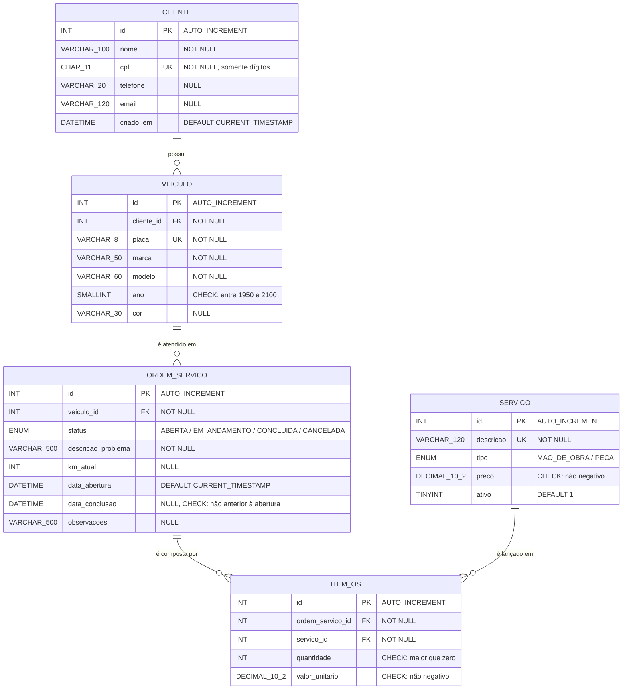

# Modelagem de Dados — DER e Dicionário de Dados

Sistema de Ordens de Serviço de uma oficina mecânica.
SGBD: **MySQL 8.4** · Engine: **InnoDB** · Charset: **utf8mb4**

O script DDL completo e comentado está em [`../sql/01_schema.sql`](../sql/01_schema.sql).

## Diagrama Entidade-Relacionamento



> Notação pé-de-galinha: `||` = exatamente um · `o{` = zero ou muitos.

Em texto, para quem visualizar o arquivo fora do GitHub:

    CLIENTE  1 ────< N  VEICULO  1 ────< N  ORDEM_SERVICO
                                                  │ 1
                                                  │
                                                  ∨ N
                                              ITEM_OS
                                                  ∧ N
                                                  │
                                                  │ 1
                                              SERVICO

`ORDEM_SERVICO` e `SERVICO` têm relacionamento **N:N**, resolvido pela entidade
associativa `ITEM_OS`.

## Cardinalidades

| Relacionamento | Cardinalidade | Leitura |
|---|---|---|
| CLIENTE → VEICULO | 1 : N | Um cliente possui zero ou muitos veículos; todo veículo tem exatamente um dono |
| VEICULO → ORDEM_SERVICO | 1 : N | Um veículo é atendido em zero ou muitas OS; toda OS é de exatamente um veículo |
| ORDEM_SERVICO → ITEM_OS | 1 : N | Uma OS é composta por zero ou muitos itens |
| SERVICO → ITEM_OS | 1 : N | Um serviço do catálogo pode ser lançado em muitas OS |
| ORDEM_SERVICO ↔ SERVICO | N : N | Resolvido por `ITEM_OS`, que ainda guarda quantidade e preço praticado |

## Restrições de integridade referencial

| FK | Referencia | ON DELETE | ON UPDATE | Por quê |
|---|---|---|---|---|
| `veiculo.cliente_id` | `cliente.id` | `RESTRICT` | `CASCADE` | Não se apaga um cliente que ainda tem veículo na oficina |
| `ordem_servico.veiculo_id` | `veiculo.id` | `RESTRICT` | `CASCADE` | O histórico de OS do veículo não pode ser perdido |
| `item_os.ordem_servico_id` | `ordem_servico.id` | `CASCADE` | `CASCADE` | Itens só existem dentro de uma OS: apagou a OS, apagou os itens |
| `item_os.servico_id` | `servico.id` | `RESTRICT` | `CASCADE` | Serviço já lançado em alguma OS não pode sumir do catálogo |

## Dicionário de dados

### cliente
Proprietário dos veículos atendidos.

| Coluna | Tipo | Nulo | Restrição |
|---|---|---|---|
| `id` | `INT UNSIGNED` | não | PK, `AUTO_INCREMENT` |
| `nome` | `VARCHAR(100)` | não | Índice `idx_cliente_nome` |
| `cpf` | `CHAR(11)` | não | `UNIQUE`, `CHECK (cpf REGEXP '^[0-9]{11}$')` — somente dígitos |
| `telefone` | `VARCHAR(20)` | sim | |
| `email` | `VARCHAR(120)` | sim | |
| `criado_em` | `DATETIME` | não | `DEFAULT CURRENT_TIMESTAMP` |

### veiculo
Um cliente possui N veículos.

| Coluna | Tipo | Nulo | Restrição |
|---|---|---|---|
| `id` | `INT UNSIGNED` | não | PK, `AUTO_INCREMENT` |
| `cliente_id` | `INT UNSIGNED` | não | FK → `cliente.id` |
| `placa` | `VARCHAR(8)` | não | `UNIQUE` — Mercosul (`ABC1D23`) ou antiga (`ABC-1234`) |
| `marca` | `VARCHAR(50)` | não | |
| `modelo` | `VARCHAR(60)` | não | |
| `ano` | `SMALLINT UNSIGNED` | não | `CHECK (ano BETWEEN 1950 AND 2100)` |
| `cor` | `VARCHAR(30)` | sim | |

### servico
Catálogo de mão de obra e peças, com preço de tabela.

| Coluna | Tipo | Nulo | Restrição |
|---|---|---|---|
| `id` | `INT UNSIGNED` | não | PK, `AUTO_INCREMENT` |
| `descricao` | `VARCHAR(120)` | não | `UNIQUE` |
| `tipo` | `ENUM('MAO_DE_OBRA','PECA')` | não | `DEFAULT 'MAO_DE_OBRA'` |
| `preco` | `DECIMAL(10,2)` | não | `CHECK (preco >= 0)` |
| `ativo` | `TINYINT(1)` | não | `DEFAULT 1` — inativo não entra em OS nova |

### ordem_servico
Cabeçalho da OS. **O valor total não é armazenado.**

| Coluna | Tipo | Nulo | Restrição |
|---|---|---|---|
| `id` | `INT UNSIGNED` | não | PK, `AUTO_INCREMENT` |
| `veiculo_id` | `INT UNSIGNED` | não | FK → `veiculo.id` |
| `status` | `ENUM(...)` | não | `ABERTA`, `EM_ANDAMENTO`, `CONCLUIDA`, `CANCELADA` · `DEFAULT 'ABERTA'` · índice `idx_os_status` |
| `descricao_problema` | `VARCHAR(500)` | não | Relato do cliente |
| `km_atual` | `INT UNSIGNED` | sim | Quilometragem na entrada |
| `data_abertura` | `DATETIME` | não | `DEFAULT CURRENT_TIMESTAMP` · índice `idx_os_data_abertura` |
| `data_conclusao` | `DATETIME` | sim | `CHECK (data_conclusao IS NULL OR data_conclusao >= data_abertura)` |
| `observacoes` | `VARCHAR(500)` | sim | |

### item_os
Entidade associativa N:N entre `ordem_servico` e `servico`.

| Coluna | Tipo | Nulo | Restrição |
|---|---|---|---|
| `id` | `INT UNSIGNED` | não | PK, `AUTO_INCREMENT` |
| `ordem_servico_id` | `INT UNSIGNED` | não | FK → `ordem_servico.id` |
| `servico_id` | `INT UNSIGNED` | não | FK → `servico.id` |
| `quantidade` | `INT UNSIGNED` | não | `CHECK (quantidade > 0)` · `DEFAULT 1` |
| `valor_unitario` | `DECIMAL(10,2)` | não | `CHECK (valor_unitario >= 0)` |

`CONSTRAINT uq_item_os UNIQUE (ordem_servico_id, servico_id)` — o mesmo serviço
entra uma única vez por OS; repetir significa aumentar a quantidade.

## Decisões de normalização

O modelo está na **3ª Forma Normal**. Duas decisões merecem destaque:

**1. O total da OS não é armazenado.**
Guardar `ordem_servico.valor_total` seria dependência transitiva de dados que já
estão em `item_os`, e qualquer alteração de item deixaria o total defasado. O
valor é sempre calculado:

```sql
SELECT SUM(quantidade * valor_unitario) FROM item_os WHERE ordem_servico_id = ?;
```

**2. `item_os.valor_unitario` não é redundância — é histórico.**
À primeira vista o preço já está em `servico.preco`. Mas `servico.preco` é o
preço *de tabela hoje*, e `item_os.valor_unitario` é o preço *cobrado naquela OS*.
São fatos diferentes: se a oficina reajustar a tabela, as OS já emitidas não
podem mudar de valor. Por isso o preço é copiado no momento do lançamento.
