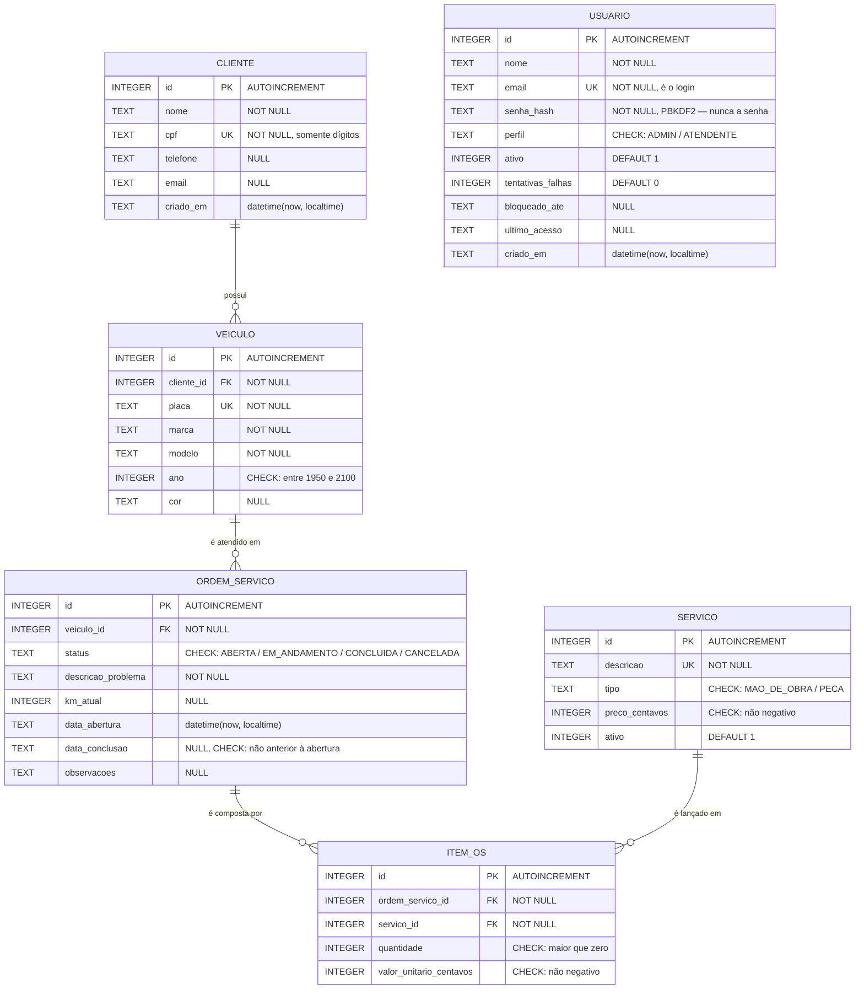

# Modelagem de Dados — DER e Dicionário de Dados

Sistema de Ordens de Serviço de uma oficina mecânica.
SGBD: **SQLite 3** (banco em arquivo, sem servidor) · Charset: **UTF-8**

O script DDL completo e comentado está em [`../sql/01_schema.sql`](../sql/01_schema.sql).

## Diagrama Entidade-Relacionamento


```mermaid
erDiagram
    CLIENTE ||--o{ VEICULO : "possui"
    VEICULO ||--o{ ORDEM_SERVICO : "é atendido em"
    ORDEM_SERVICO ||--o{ ITEM_OS : "é composta por"
    SERVICO ||--o{ ITEM_OS : "é lançado em"

    CLIENTE {
        INTEGER id PK "AUTOINCREMENT"
        TEXT nome "NOT NULL"
        TEXT cpf UK "NOT NULL, somente dígitos"
        TEXT telefone "NULL"
        TEXT email "NULL"
        TEXT criado_em "datetime(now, localtime)"
    }

    VEICULO {
        INTEGER id PK "AUTOINCREMENT"
        INTEGER cliente_id FK "NOT NULL"
        TEXT placa UK "NOT NULL"
        TEXT marca "NOT NULL"
        TEXT modelo "NOT NULL"
        INTEGER ano "CHECK: entre 1950 e 2100"
        TEXT cor "NULL"
    }

    SERVICO {
        INTEGER id PK "AUTOINCREMENT"
        TEXT descricao UK "NOT NULL"
        TEXT tipo "CHECK: MAO_DE_OBRA / PECA"
        INTEGER preco_centavos "CHECK: não negativo"
        INTEGER ativo "DEFAULT 1"
    }

    ORDEM_SERVICO {
        INTEGER id PK "AUTOINCREMENT"
        INTEGER veiculo_id FK "NOT NULL"
        TEXT status "CHECK: ABERTA / EM_ANDAMENTO / CONCLUIDA / CANCELADA"
        TEXT descricao_problema "NOT NULL"
        INTEGER km_atual "NULL"
        TEXT data_abertura "datetime(now, localtime)"
        TEXT data_conclusao "NULL, CHECK: não anterior à abertura"
        TEXT observacoes "NULL"
    }

    ITEM_OS {
        INTEGER id PK "AUTOINCREMENT"
        INTEGER ordem_servico_id FK "NOT NULL"
        INTEGER servico_id FK "NOT NULL"
        INTEGER quantidade "CHECK: maior que zero"
        INTEGER valor_unitario_centavos "CHECK: não negativo"
    }

    USUARIO {
        INTEGER id PK "AUTOINCREMENT"
        TEXT nome "NOT NULL"
        TEXT email UK "NOT NULL, é o login"
        TEXT senha_hash "NOT NULL, PBKDF2 — nunca a senha"
        TEXT perfil "CHECK: ADMIN / ATENDENTE"
        INTEGER ativo "DEFAULT 1"
        INTEGER tentativas_falhas "DEFAULT 0"
        TEXT bloqueado_ate "NULL"
        TEXT ultimo_acesso "NULL"
        TEXT criado_em "datetime(now, localtime)"
    }
```

A mesma figura em imagem, para leitura fora do GitHub:


> As datas usam `datetime('now','localtime')`, não `CURRENT_TIMESTAMP`: no
> SQLite este último grava em **UTC**, e a data de abertura da OS apareceria
> adiantada em três horas.

> Notação pé-de-galinha: `||` = exatamente um · `o{` = zero ou muitos.

`USUARIO` aparece solta no diagrama de propósito: ela não faz parte do domínio
da oficina (cliente, veículo, serviço, OS), e sim do **controle de acesso** ao
sistema. Não há FK ligando usuário a ordem de serviço porque a OS é um fato do
negócio — ela continua válida mesmo que o funcionário que a digitou seja
excluído do sistema depois.

Em texto, para quem visualizar o arquivo fora do GitHub:

    CLIENTE  1 ────< N  VEICULO  1 ────< N  ORDEM_SERVICO
                                                  │ 1
                                                  │
                                                  ∨ N
                                              ITEM_OS
                                                  ∧ N
                                                  │
                                                  │ 1
                                              SERVICO

`ORDEM_SERVICO` e `SERVICO` têm relacionamento **N:N**, resolvido pela entidade
associativa `ITEM_OS`.

## Cardinalidades

| Relacionamento | Cardinalidade | Leitura |
|---|---|---|
| CLIENTE → VEICULO | 1 : N | Um cliente possui zero ou muitos veículos; todo veículo tem exatamente um dono |
| VEICULO → ORDEM_SERVICO | 1 : N | Um veículo é atendido em zero ou muitas OS; toda OS é de exatamente um veículo |
| ORDEM_SERVICO → ITEM_OS | 1 : N | Uma OS é composta por zero ou muitos itens |
| SERVICO → ITEM_OS | 1 : N | Um serviço do catálogo pode ser lançado em muitas OS |
| ORDEM_SERVICO ↔ SERVICO | N : N | Resolvido por `ITEM_OS`, que ainda guarda quantidade e preço praticado |

## Restrições de integridade referencial

| FK | Referencia | ON DELETE | ON UPDATE | Por quê |
|---|---|---|---|---|
| `veiculo.cliente_id` | `cliente.id` | `RESTRICT` | `CASCADE` | Não se apaga um cliente que ainda tem veículo na oficina |
| `ordem_servico.veiculo_id` | `veiculo.id` | `RESTRICT` | `CASCADE` | O histórico de OS do veículo não pode ser perdido |
| `item_os.ordem_servico_id` | `ordem_servico.id` | `CASCADE` | `CASCADE` | Itens só existem dentro de uma OS: apagou a OS, apagou os itens |
| `item_os.servico_id` | `servico.id` | `RESTRICT` | `CASCADE` | Serviço já lançado em alguma OS não pode sumir do catálogo |

## Dicionário de dados

### cliente
Proprietário dos veículos atendidos.

| Coluna | Tipo | Nulo | Restrição |
|---|---|---|---|
| `id` | `INTEGER` | não | PK, `AUTOINCREMENT` |
| `nome` | `TEXT` | não | Índice `idx_cliente_nome` |
| `cpf` | `TEXT` | não | `UNIQUE`, `CHECK (cpf GLOB ...)` — exatamente 11 dígitos |
| `telefone` | `TEXT` | sim | |
| `email` | `TEXT` | sim | |
| `criado_em` | `TEXT` | não | `DEFAULT (datetime('now','localtime'))` |

### veiculo
Um cliente possui N veículos.

| Coluna | Tipo | Nulo | Restrição |
|---|---|---|---|
| `id` | `INTEGER` | não | PK, `AUTOINCREMENT` |
| `cliente_id` | `INTEGER` | não | FK → `cliente.id` |
| `placa` | `TEXT` | não | `UNIQUE` — Mercosul (`ABC1D23`) ou antiga (`ABC-1234`) |
| `marca` | `TEXT` | não | |
| `modelo` | `TEXT` | não | |
| `ano` | `INTEGER` | não | `CHECK (ano BETWEEN 1950 AND 2100)` |
| `cor` | `TEXT` | sim | |

### servico
Catálogo de mão de obra e peças, com preço de tabela.

| Coluna | Tipo | Nulo | Restrição |
|---|---|---|---|
| `id` | `INTEGER` | não | PK, `AUTOINCREMENT` |
| `descricao` | `TEXT` | não | `UNIQUE` |
| `tipo` | `TEXT` | não | `CHECK (tipo IN ('MAO_DE_OBRA','PECA'))` · `DEFAULT 'MAO_DE_OBRA'` |
| `preco_centavos` | `INTEGER` | não | `CHECK (preco_centavos >= 0)` — valor em centavos |
| `ativo` | `INTEGER` | não | `DEFAULT 1` — inativo não entra em OS nova |

### ordem_servico
Cabeçalho da OS. **O valor total não é armazenado.**

| Coluna | Tipo | Nulo | Restrição |
|---|---|---|---|
| `id` | `INTEGER` | não | PK, `AUTOINCREMENT` |
| `veiculo_id` | `INTEGER` | não | FK → `veiculo.id` |
| `status` | `TEXT` | não | `CHECK (status IN (...))`: `ABERTA`, `EM_ANDAMENTO`, `CONCLUIDA`, `CANCELADA` · `DEFAULT 'ABERTA'` · índice `idx_os_status` |
| `descricao_problema` | `TEXT` | não | Relato do cliente |
| `km_atual` | `INTEGER` | sim | Quilometragem na entrada |
| `data_abertura` | `TEXT` | não | `DEFAULT (datetime('now','localtime'))` · índice `idx_os_data_abertura` |
| `data_conclusao` | `TEXT` | sim | `CHECK (data_conclusao IS NULL OR data_conclusao >= data_abertura)` |
| `observacoes` | `TEXT` | sim | |

### item_os
Entidade associativa N:N entre `ordem_servico` e `servico`.

| Coluna | Tipo | Nulo | Restrição |
|---|---|---|---|
| `id` | `INTEGER` | não | PK, `AUTOINCREMENT` |
| `ordem_servico_id` | `INTEGER` | não | FK → `ordem_servico.id` |
| `servico_id` | `INTEGER` | não | FK → `servico.id` |
| `quantidade` | `INTEGER` | não | `CHECK (quantidade > 0)` · `DEFAULT 1` |
| `valor_unitario_centavos` | `INTEGER` | não | `CHECK (valor_unitario_centavos >= 0)` — em centavos |

`CONSTRAINT uq_item_os UNIQUE (ordem_servico_id, servico_id)` — o mesmo serviço
entra uma única vez por OS; repetir significa aumentar a quantidade.

### usuario
Quem pode entrar no sistema. Fora do domínio da oficina, sem FK (ver a nota
abaixo do diagrama).

| Coluna | Tipo | Nulo | Restrição |
|---|---|---|---|
| `id` | `INTEGER` | não | PK, `AUTOINCREMENT` |
| `nome` | `TEXT` | não | `CHECK (CHAR_LENGTH(nome) >= 2)` |
| `email` | `TEXT` | não | `UNIQUE` — é o login · `CHECK (email LIKE '_%@_%._%')` |
| `senha_hash` | `TEXT` | não | `CHECK (senha_hash LIKE 'pbkdf2\_sha256$%' ESCAPE '\')` — o banco recusa senha em texto puro |
| `perfil` | `ENUM('ADMIN','ATENDENTE')` | não | `DEFAULT 'ATENDENTE'` |
| `ativo` | `INTEGER` | não | `DEFAULT 1` — inativo não consegue entrar |
| `tentativas_falhas` | `INTEGER` | não | `DEFAULT 0` — contador de senhas erradas |
| `bloqueado_ate` | `TEXT` | sim | Bloqueio temporário por força bruta |
| `ultimo_acesso` | `TEXT` | sim | Carimbado a cada login aceito |
| `criado_em` | `TEXT` | não | `DEFAULT (datetime('now','localtime'))` |

**A senha nunca é armazenada.** A coluna guarda o resultado de um PBKDF2-SHA256
com sal aleatório, no formato `pbkdf2_sha256$iteracoes$sal$hash`. O `CHECK` acima
é a última linha de defesa: mesmo um `INSERT` feito direto no arquivo do banco, por fora da
aplicação, é recusado se tentar gravar a senha em texto puro.

## Resumo das restrições

O schema tem **6 tabelas** e **24 restrições**:

| Tipo | Quantidade |
|---|---|
| `CHECK` | 9 |
| `PRIMARY KEY` | 6 |
| `UNIQUE` | 5 |
| `FOREIGN KEY` | 4 |

Os números podem ser conferidos no próprio banco com a consulta 7b de
[`evidencias.sql`](evidencias.sql).

## Por que o dinheiro é inteiro

O SQLite não tem tipo decimal de verdade: uma coluna declarada `DECIMAL(10,2)`
acaba guardando ponto flutuante, e somar dinheiro em float pode render centavo
errado. Por isso os valores são **inteiros de centavos** (`preco_centavos`,
`valor_unitario_centavos`): `4590` é R$ 45,90. Assim `SUM()` é exato.

A conversão para reais acontece numa fronteira só, em `util/Dinheiro.java`, e
os modelos Java seguem usando `BigDecimal` — a API e as telas não mudaram.

## Decisões de normalização

O modelo está na **3ª Forma Normal**. Duas decisões merecem destaque:

**1. O total da OS não é armazenado.**
Guardar `ordem_servico.valor_total` seria dependência transitiva de dados que já
estão em `item_os`, e qualquer alteração de item deixaria o total defasado. O
valor é sempre calculado:

```sql
SELECT SUM(quantidade * valor_unitario_centavos) FROM item_os WHERE ordem_servico_id = ?;
```

**2. `item_os.valor_unitario_centavos` não é redundância — é histórico.**
À primeira vista o preço já está em `servico.preco`. Mas `servico.preco` é o
preço *de tabela hoje*, e `item_os.valor_unitario_centavos` é o preço *cobrado naquela OS*.
São fatos diferentes: se a oficina reajustar a tabela, as OS já emitidas não
podem mudar de valor. Por isso o preço é copiado no momento do lançamento.
